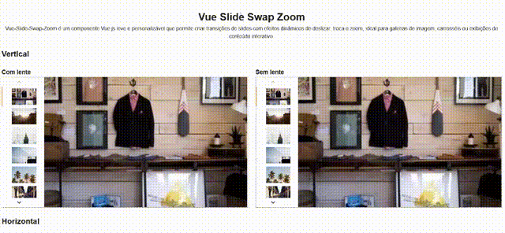

# Vue-Slide-Swap-Zoom
Um componente Vue 3 de galeria de imagens com suporte a zoom interativo (com vue-photo-zoom-pro) e modo de exibição vertical ou horizontal, ideal para exibir imagens de produtos, portfólios ou galerias com navegação intuitiva.


## Recursos
* Visualização em tabs verticais ou horizontais
* Zoom interativo em imagens com vue-photo-zoom-pro
* Totalmente responsivo usando Vuetify
* Lazy loading de imagens
* Controle de seleção de slides

##  Instalação
Certifique-se de que seu projeto esteja usando Vue 3 e Vuetify 3.

#### Instale os pacotes necessários:
```bash 
npm install vue-photo-zoom-pro
npm install vue3-carousel
```
Obs: O Vuetify deve estar previamente instalado e configurado no projeto.

##  Uso
```vue
<template>
      <VSlideSwapZoom :images="images" :is_magnify="true" :is_vertical="true"></VSlideSwapZoom>
</template>
<script>
import { defineComponent } from 'vue';
export default defineComponent({
  data:()=>({
    images: [],
  }),
  created() {
    this.images = Array.from({length: 10}, (_, index) => ({
      id: index + 1,
      url: `https://picsum.photos/400/200?random=${index + 1}`,
    }))
  },
});
</script>

```

## Props
| Prop          | Tipo      | Default | Descrição                                                                               |
| ------------- | --------- | ------- | --------------------------------------------------------------------------------------- |
| `images`      | `Array`   | `[]`    | Lista de imagens com `{ url: '...' }`.                                                  |
| `is_magnify`  | `Boolean` | `false` | Ativa o zoom com `vue-photo-zoom-pro`.                                                  |
| `is_vertical` | `Boolean` | `false` | Define se os thumbnails serão exibidos verticalmente (true) ou horizontalmente (false). |

## Exemplo de Estrutura do images
 ```js
 [
   { url: 'https://meusite.com/img1.jpg' },
   { url: 'https://meusite.com/img2.jpg' },
 ]
```

## Dependências
* Vue 3
* Vuetify 3
* vue-photo-zoom-pro
* vue3-carousel

